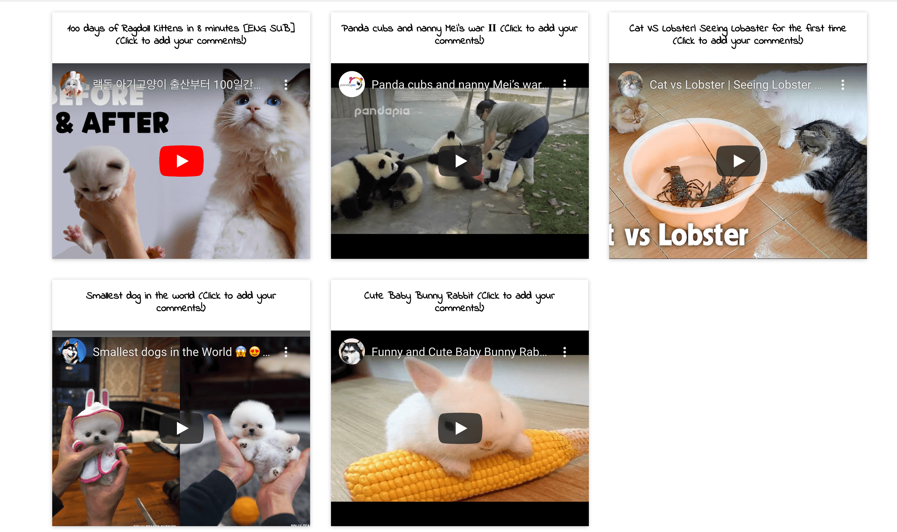
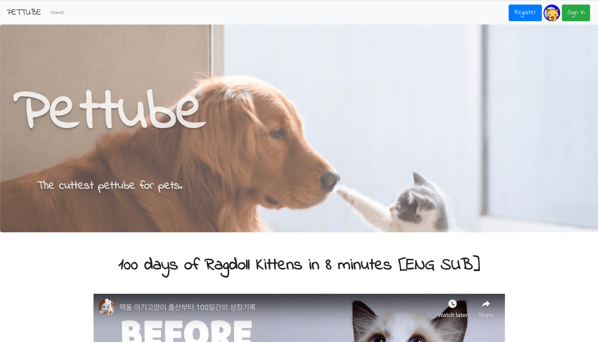
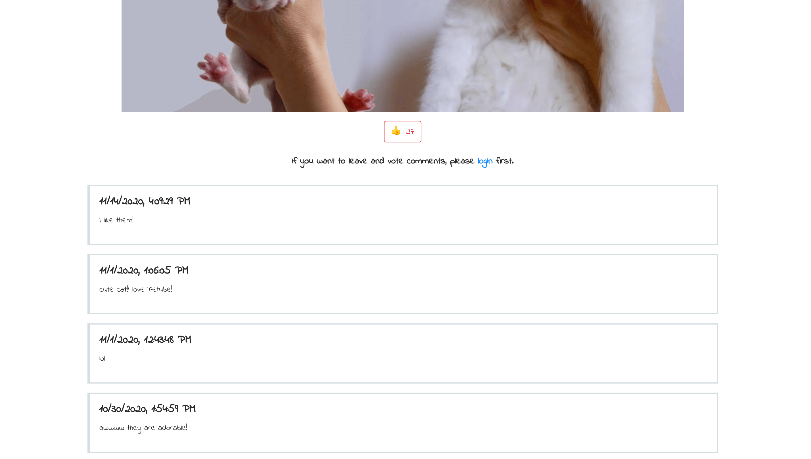

# Petube-Redesign-Project3

### Project Description

Welcome to Petube and watch cute animal videos! We are a web streaming application which offers online streaming of a library of our carefully selected videos. You can also sign up and log in to add your comments and likes to your favorite videos. It’s like a Netflix for animal lovers and a happy place that will melt your heart.

In the homepage, you can see all of our curated videos. You can just watch the videos on the homepage. If you want to get interactive, you can click the title of the video you’re interested, which will bring you to the video’s own page. Once you registered and logged in, you can add comments and likes to express your opinion about the video!

### Screenshot

### Instruction to Build

The database is on MongoDB Atlas and the website is hosted on heroku here. To install and run, do the following:
Note you may need to contact us to get our MongoDB database url.

git clone

cd Petube

yarn install

yarn start

cd front

yarn install

yarn build

yarn start

### Project Objective

Design Website based on accessibilities and other design considerations. Learn and explore the popular and powerful MERN stack techologies(MongoDB, Express.js, React, and Node.js)to building dynamic web sites and web applications. Because all components of the MERN stack support programs that are written in JavaScript, we can learn more about Javascript via building the MERN applicationsusing one language for both server-side and client-side execution environments.

### Author

Michelle Duan based on Xintong Liu & Michelle Duan's Project 2

### Class Link

CS 5610 Web Development
https://johnguerra.co/classes/webDevelopment_fall_2020/

### Licence

This project is under MIT license.


### Instruction to Build

The database is on MongoDB Atlas and the website is hosted on heroku here. To install and run, do the following:

git clone

cd Petube

yarn install

yarn start

cd front

yarn install

yarn build

yarn start

### Project Objective

Learn and explore the popular and powerful MERN stack techologies(MongoDB, Express.js, React, and Node.js)to building dynamic web sites and web applications. Because all components of the MERN stack support programs that are written in JavaScript, we can learn more about Javascript via building the MERN applicationsusing one language for both server-side and client-side execution environments.

### Author

Michelle Duan based on Xintong Liu & Michelle Duan's Project 2

### Class Link

CS 5610 Web Development
https://johnguerra.co/classes/webDevelopment_fall_2020/

### Licence

This project is under MIT license.


### Demo Video

Watch our project 3 demo video here:
https://youtu.be/miBzMvBFSUY
